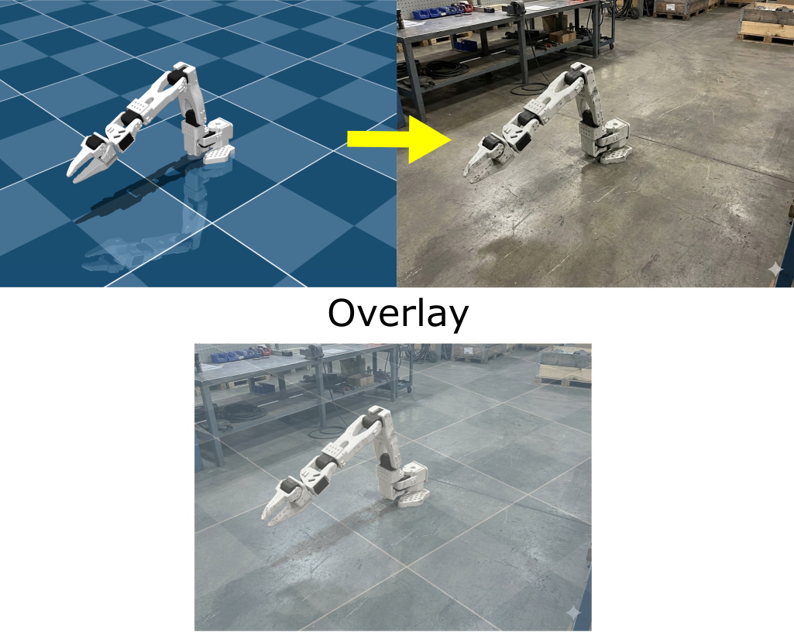

# LeRobotHackathonEnv
Minimal, extendable LeRobot gym environment.

## Installation

```bash
git clone https://github.com/uakel/LeRobotHackathonEnv.git
cd LeRobotHackathonEnv
uv sync
```

## Test installation
Run `uv run test/mj_viewer_rendering.py` and `uv run pytest`.

## Getting started
See [`tests/`](tests/)

## StdTask
`ExtendedTask`s in the [`tasks.py`](src/lerobothackathonenv/tasks.py) script define the observation dict and the reward function. A template implementation "`StdTask`" is provided.

### Observation space
The environment provides dict observations containing:
- `qpos`: Joint positions (6-dimensional, range: -3 to 3)
- `qvel`: Joint velocities (6-dimensional, range: -10 to 10)
- `actuator_force`: Actuator forces (6-dimensional, range: -3.35 to 3.35)

### Action space
- **Type**: Continuous
- **Shape**: (6,) - 6 joint torques
- **Range**: [-1, 1]

## Modifying the environment
Subclass `ExtendedTask` to modify the observations and reward:

```python
from lerobothackathonenv.types import ExtendedTask
from gymnasium import spaces

class MyCustomTask(ExtendedTask):
    ACTION_SPACE = spaces.Box(...)
    OBSERVATION_SPACE = spaces.Dict({...})

    def get_observation(self, physics):
        # Define custom observation logic
        pass

    def get_reward(self, physics):
        # Define custom reward function
        pass

# Use custom task
env = LeRobot(dm_control_task_desc=MyCustomTask())
```

We should consider to add an interface to `ExtendedTask` that standardizes adding objects and new textures to the environment.

### Writing and running tests
Add test function with "test" in the function name to a script in the [tests](tests/) folder and run

```bash
uv run pytest
```

## Robot
The robot model used is the SO-101. The motor presets are for the STS3215 servo motor.

## Nano banana 3 style transfer test
**Prompt:** *Please generate this robot in a realistic scene for sim to real transfer*

**Result:**


On the top are the input and output images and on the bottom I overlayed both images with 50% opacity. One can see that the geometry is preserved pretty much perfectly.

## Acknowledgments
The xml files are taken from: https://github.com/TheRobotStudio/SO-ARM100.git
